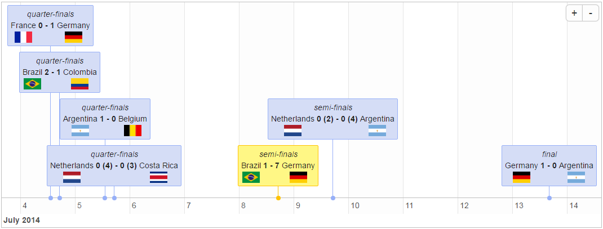

timevis - Create interactive timeline visualizations in R
=========================================================

`timevis` lets you create rich and fully interactive timeline
visualizations in R. Timelines can be included in Shiny apps and R
markdown documents, or viewed from the R console and RStudio Viewer.
`timevis` includes an extensive API to manipulate a timeline after
creation, and supports getting data out of the visualization into R.
This package is based on the \[vis.js\]\[<http://visjs.org/>) Timeline
module and the [htmlwidgets](http://www.htmlwidgets.org/) R package.

View a live demo of `timevis` and its capabilities
[here](http://daattali.com/shiny/timevis-demo/).

### Installation

`timevis` is available through both CRAN and GitHub:

To install the stable CRAN version:

    install.packages("timevis")

To install the latest development version from GitHub:

    install.packages("devtools")
    devtools::install_github("daattali/timevis")

### How to use

You can view a minimal timeline without any data by simply running

    library(timevis)
    timevis()

You can add data to the timeline by supplying a data.frame

    data <- data.frame(
      id = 1:4,
      content = c("Item one"  , "Item two"  ,"Ranged item", "Item four"),
      start   = c("2016-01-10", "2016-01-11", "2016-01-20", "2016-02-14 15:00:00"),
      end     = c(NA          ,           NA, "2016-02-04", NA)
    )

    timevis(data)

Every item must have a `content` and a `start` variable. If the item is
a range rather than a single point in time, you can supply an `end` as
well. `id` is only required if you want to access or manipulate an item.
There are more variables that can be used in the data.frame -- they are
all documented in the documentation for `?timevis()`.

The content of an item can include HTML, which makes it easy to show any
kind of data in a timeline, such as the matches of the 2014 World Cup:

If you know some CSS, you can completely customize the look of the
timeline:

By default, a timeline will show the current date as a red vertical line
and will have zoom in/out buttons. You can move to future and past dates
by clicking anywhere and dragging the mouse to the right or left. Of
course the zooming and moving won't work on this image, but if you run
`timevis()` in RStudio you will be able to interact with the timeline.

`timevisOutput()` `renderTimevis()`
